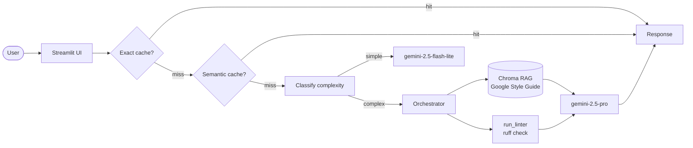

# 🐍 MentAI: Code Review & Compliance Python

> Assistente inteligente que revisa código Python e verifica conformidade com o Google Python Style Guide, combinando RAG, análise estática com `ruff` e model routing para desenvolvedores que querem escrever código mais limpo.

<!-- GIF de demo aqui -->

**Live demo:** TODO — substituir pelo link do Streamlit Cloud

## Problem statement

1. Desenvolvedores Python perdem tempo em code reviews manuais verificando conformidade com style guides extensos como o Google Python Style Guide (32 páginas densas).
2. Para times de desenvolvimento Python que precisam manter consistência de código sem depender de revisores humanos para cada PR.
3. LLM + RAG é a abordagem certa porque o style guide é um corpus textual denso com regras interdependentes — busca simples retorna trechos sem contexto; o LLM sintetiza as regras relevantes e as aplica ao código submetido. A tool `run_linter` complementa com análise determinística via `ruff`, combinando o melhor dos dois mundos.

## Arquitetura



## Setup

```bash
# 1. Clone
git clone <seu-repo>
cd template-portfolio

# 2. Dependencias
uv venv && source .venv/bin/activate
uv sync

# 3. API key
cp .env.example .env
# edite .env com sua GEMINI_API_KEY

# 4. Corpus
# Coloque o Google Python Style Guide em PDF em data/corpus/
# Download: https://google.github.io/styleguide/pyguide.html → Ctrl+P → Salvar PDF

# 5. Rodar local
streamlit run src/ui/streamlit_app.py
```

## Cost & Latency

TODO — preencher após rodar bench de 50 queries.

| Estratégia | Custo total | Redução | P95 latency |
|---|---:|---:|---:|
| Baseline (premium sempre) | $X.XX | — | XX ms |
| + Exact cache | $X.XX | XX% | XX ms |
| + Semantic cache | $X.XX | XX% | XX ms |
| **+ Routing cheap-first** | **$X.XX** | **XX%** | **XX ms** |

## Design decisions

- **Embedding model `gemini-embedding-001`:** escolhido por ser gratuito no free tier e ter boa performance em texto técnico em inglês — o corpus do Google Style Guide é inteiramente em inglês.
- **`chunk_size=800, overlap=100`:** o Style Guide tem seções de Decision (~300-600 chars) e exemplos de código (~200-400 chars). Chunks de 800 capturam seção + exemplo sem fragmentar o raciocínio; overlap de 100 evita cortar frases no meio.
- **Tool `run_linter` com `ruff`:** `ruff` é 10-100x mais rápido que `pylint` e `flake8`, tem output limpo e é o padrão emergente. Usamos `subprocess` com arquivo temporário — nunca `eval()` — por segurança.
- **Tradução da query antes do retrieval:** o corpus está em inglês; perguntas em português têm similaridade cosseno baixa contra os chunks. A tradução via LLM antes do `retrieve()` aumenta significativamente a qualidade do contexto recuperado.
- **Sem re-ranking:** corpus pequeno (~100 chunks), latência é mais crítica que precisão marginal de re-ranking. Top-5 por similaridade cosseno é suficiente.

## Limitations

- O corpus cobre apenas o Google Python Style Guide — não inclui PEP 8 completo, guias de frameworks como Django ou FastAPI, ou convenções de outros times.
- O free tier do Gemini limita a 100 requests/min para embeddings — a indexação inicial requer `time.sleep(6)` entre batches e leva ~3-5 minutos.
- A demo não suporta upload de PDF pelo usuário — o corpus é fixo. Para usar outro style guide seria necessário reindexar manualmente.

## Tech stack

- **LLM:** Gemini 2.5 Flash-Lite (cheap) / Gemini 2.5 Pro (premium)
- **Embeddings:** gemini-embedding-001
- **Linter:** ruff (sandboxed via subprocess)
- **Vector store:** Chroma local
- **UI:** Streamlit
- **Observability:** structured logs com trace_id
- **Deploy:** Streamlit Community Cloud

## Estrutura

```
template-portfolio/
├── data/
│   ├── corpus/           # Google Python Style Guide PDF
│   └── chroma/           # vector store (gitignored)
├── src/
│   ├── ui/streamlit_app.py
│   ├── pipeline/
│   │   ├── rag.py        # TODOs 1-3 ✅
│   │   ├── tools.py      # TODO 4 ✅ (run_linter)
│   │   ├── cache.py      # TODO 5 ✅
│   │   └── routing.py    # TODO 6 ✅
│   └── observability/trace.py
├── tests/test_smoke.py
├── pyproject.toml
├── .env.example
└── README.md
```

## Os 6 TODOs (mapa rápido)

| TODO | Arquivo | Tempo estimado | Material de referência |
|---|---|---:|---|
| **1** | `src/pipeline/rag.py::ingest_and_index` | 20 min | notebook 02 Etapas 1+2+3 |
| **2** | `src/pipeline/rag.py::retrieve` | 5 min | notebook 02 Etapa 4 |
| **3** | `src/pipeline/rag.py::answer` | 15 min | notebook 02 Etapa 5 |
| **4** | `src/pipeline/tools.py` (run_linter) | 30 min | LAB-001 + ruff docs |
| **5** | `src/pipeline/cache.py::SemanticCache.get` | 15 min | notebook 05 Etapa 4 |
| **6** | `src/pipeline/routing.py::classify_complexity` | 10 min | notebook 05 Etapa 5 |

## Rubrica

| Critério | Peso | Entrega |
|---|:-:|---|
| Técnica | 40% | TODOs 1-6 funcionando + erros tratados + logs estruturados |
| README | 30% | Problema, arquitetura, métricas, decisões, limites |
| Custo | 20% | Routing cheap-first + cache com hit-rate medido |
| Demo | 10% | URL pública acessível sem crash |

---

*Dupla: [Seu Nome] · Tony Oliveira — Disciplina "Desenvolvendo Software com IA Generativa" (Mod4 PPI).*
```
